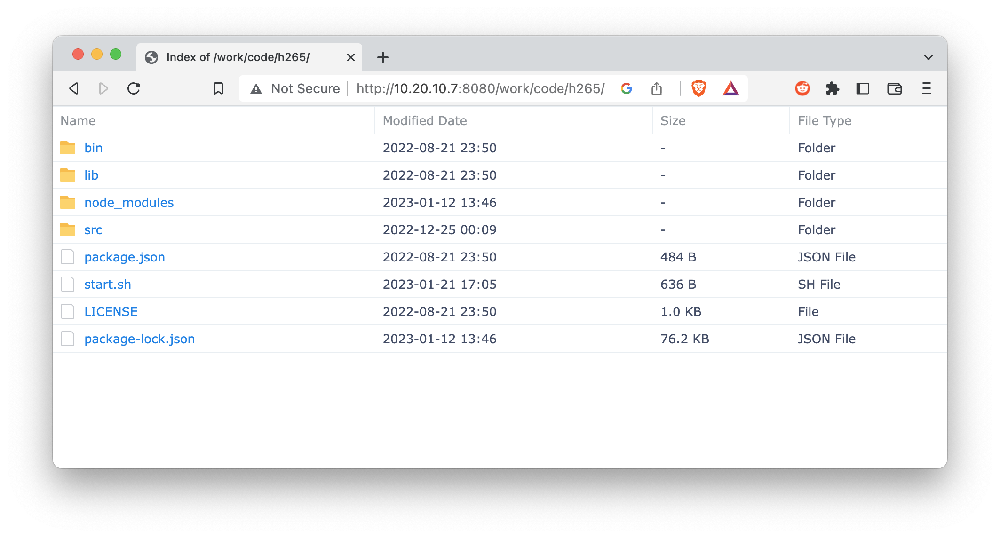

# Synology Autoindex Stylesheet

This stylesheet makes the NGINX autoindex page look like the Synology File Station.

Features implemented:

* Natural sort order
* Click to sort column headers
* Localtime support



## Installation

1. Download `nginx` directory, create docker container and run it where

* `/volume1/docker/nginx` should be a path to the `nginx` directory,
* `/volume1/docs` should be a path to the directory you want to access using NGINX.

```bash
sudo docker create \
  -v /usr/syno/synoman/webman/modules/FileBrowser/images/2x/files_ext:/usr/share/nginx/html/.assets:ro \
  -v /volume1/docker/nginx/nginx.conf:/etc/nginx/nginx.conf:ro \
  -v /volume1/docker/nginx/conf.d:/etc/nginx/conf.d:ro \
  -v /volume1/docs:/usr/share/nginx/html/docs:ro \
  -p 8080:80 \
  --name "nginx" \
  nginx:latest
```

2. Open in your browser `http://<your nas ip>:8080/docs`.
